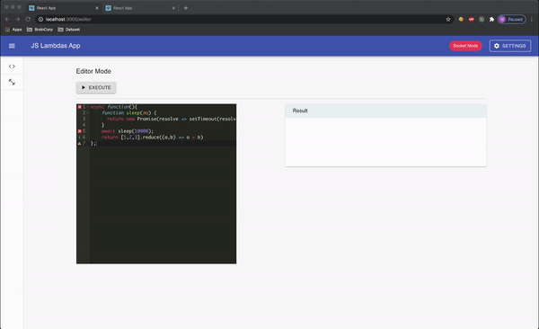

# Js Lambdas App

This app is a lightweight JS lambdas runner. It runs javaScript functions on-demand from users. It rely on and communicate with a number of worker nodes to execute these JavaScript functions and the worker nodes are browser environments, meaning each open tab is a worker able to execute job.

This apps comes with a server and and a front end app both package in a docker container. 



Starting the project is easy as: The server is verbose so if you want to see its logs don't use option `-d` with docker-compose.

```bash
$ docker-compose up 
```


Then you, open a browser with url  http://localhost:3000

## Workflow

There is 2 modes:

- `Local mode`: (automaticaly enabled if the server is unreachable) In this mode all jobs are run "localy". Each jobs get submitted to a pool of workers (4 workers by default) that is in charged of wrapping the submitted script and dispatch it to the next available workers. It is implemented that way for performance reason, (we don't want to run infinite loop or maliscious code on the main thread).
  
- `Socket mode`: (automaticaly enabled if the server running) In that case, each time you open an instance of the app in your browser, it becomes a worker! You can submit a script from each instance but the server will decide which worker will get the job. The server act as a load balancer (it dispatch jobs following a round robin algorithm) and a broker (it send jobs to worker, get result and dispatch result if needed). When a worker get a job it goes to its pool and act like it is local mode (submit the job to the first thread available). Here again we don't want to run code on the main thread.
  
  Couple edge cases:
  - If a worker is killed (you close the browser tab) before it complete all his jobs, then the server will redispatch the uncompleted jobs to other available workers.
  - If a script takes more than 30s to run, it will return an error. It is a way of avoiding infinite loops.
  - You can resize the pool of threads at any time, it wont't forget a job.
  - If you loose the connection with the server, the jobs will be pushed on the local pool.
  - If you submit multiple scripts accross different instance, you still get your result back even if it was executed on an other worker.

I wrote couples unit tests for the app, it was usefull to make sure that the worker pool was working as expected and it is also good to have unit tests when you use redux-saga (just to make sure you don't hget lost with side effects):

To run them:
```bash
# Build image first
docker build -t jslambdas-app:latest ./webapp

# Run 
docker run -it jslambdas-app yarn test
```


## Choices of library

For this project I chose Node & ReactJs. I first went with React build the local mode app. The reason for that is my understanding of `browser environement` was developing the porject using the browser feature only. But glad I asked more details, Ishmael was able to tell me he wanted to see a server to dispatch jobs. Therefore a websocket server was obvious. 

### App :

React + MaterialUI + Redux + Redux-Saga = :heart:

`MaterialUI`: The quickest way I know to get awesome designed componenents.

`Redux`: It is a state management tool. It keeps the state of your application in a store, and each component can access any state that it needs from this store

`Redux Saga`: Redux-saga is  a way of dealing with side-effects (asynchronous calls and so on) performed by an application. Incoming actions from the store invoke a function that will dispatch later an other action back to the store. 

- How redux saga is a good choice for websocket ? 
  
  It comes with an easy event channel! a channel is typical typical watch-and-fork pattern, in order to pull and handle actions. Which is exactly what we need to dispatch actions depending on incoming events in our app.

### Server :

Node + Websocket

WebSockets allow both the server and the client to push messages at any time without any relation to a previous request. One notable advantage in using websockets is, almost every browser support websockets. It solves a few issues with HTTP:
- Bi-directional protocol: either client/server can send a message to the other party (In HTTP, the request is always initiated by client and the response is processed by server)
- Full-duplex communication: client and server can talk to each other independently at the same time.
- Single TCP connection: Client and server communicate over that same TCP connection throughout the lifecycle of Websocket connection.

It is then an awesome candidate for our usecase!

